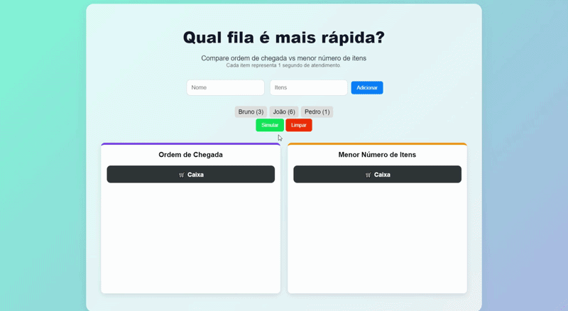

# Queue Scheduling Simulator

Simulador visual para comparação entre algoritmos de escalonamento de filas FIFO (First In, First Out) e SJF (Shortest Job First).

O projeto demonstra visualmente como diferentes estratégias de atendimento impactam o tempo médio de espera.

---

# 🎥 Simulação em execução



---

### ✅ Recursos demonstrados

- Ordem de chegada (FIFO)
- Menor número de itens (SJF)
- Simulação visual em tempo real
- Animação dos clientes no caixa
- Destaque automático da fila vencedora
- Cálculo de tempo total e médio de espera

---

# 🚀 Tecnologias utilizadas

- 🌐 HTML5
- 🎨 CSS3
- ⚡ JavaScript

---

# 🧠 Conceitos aplicados

Este projeto utiliza diversos conceitos de computação e desenvolvimento web.

## 📌 Algoritmos de escalonamento
- FIFO (First In First Out)
- SJF (Shortest Job First)

## 📌 Estruturas de dados
- Arrays
- Objetos JavaScript

## 📌 Programação assíncrona
- `async/await`
- `Promise`
- `setTimeout`

## 📌 Manipulação do DOM (Document Object Model)
- Atualização dinâmica da interface
- Renderização de elementos HTML
- Animações visuais

---

# 🎮 Como funciona

O usuário adiciona clientes com:
- Nome
- Quantidade de itens

Cada item representa:

```text
1 segundo de atendimento
```

O sistema então:

1. Cria duas filas
2. Executa as animações
3. Calcula:
   - Tempo total
   - Tempo médio
4. Destaca a fila mais eficiente 🏆

---

# 📊 Estratégias comparadas

| Estratégia | Funcionamento |
|---|---|
| FIFO | Atende por ordem de chegada |
| SJF | Prioriza clientes com menos itens |

---

# 🖥️ Interface

## ✨ Recursos visuais

- Fundo com gradiente moderno
- Cards animados
- Caixa de atendimento
- Destaque visual da fila vencedora
- Animações suaves

---

# 📂 Estrutura do projeto

```text
📁 Queue_Scheduling_Simulator
 ├── index.html
 ├── style.css
 ├── script.js
 ├── README.md
 ├── LICENSE
 └── simulacao.gif
```

O projeto está organizado em arquivos separados para facilitar a manutenção e organização do código:

- HTML → estrutura da interface
- CSS → estilização e animações
- JavaScript → lógica e simulação

---

# ⚙️ Funcionalidades

## ✅ Adicionar clientes
Permite adicionar até 5 clientes por simulação.

---

## ✅ Simulação visual
Os clientes são atendidos em tempo real.

---

## ✅ Comparação automática
O sistema identifica automaticamente qual fila foi mais rápida.

---

## ✅ Animações
Os clientes:
- entram na fila
- vão para o caixa
- saem após o atendimento

---

# 🧮 Exemplo de cálculo

Se os clientes tiverem:

```text
Cliente A → 5 itens
Cliente B → 2 itens
Cliente C → 1 item
```

A fila SJF será reorganizada para:

```text
1 → 2 → 5
```

reduzindo o tempo médio de espera.

---

# 📌 Objetivo educacional

Este projeto foi desenvolvido para demonstrar de forma visual:

- algoritmos de filas
- escalonamento de processos
- tempo médio de espera
- experiência do usuário com animações

---

# ▶️ Como executar

1. Baixe ou clone o repositório

2. Certifique-se de que os arquivos estejam na mesma pasta:
   - index.html
   - style.css
   - script.js

3. Abra o arquivo:

```text
index.html
```

em qualquer navegador.

---
# 📄 Licença

Este projeto está sob a licença MIT.

Isso significa que o código pode ser utilizado, modificado e distribuído livremente para fins educacionais e pessoais.

---

# 👨‍💻 Autor

Bruno Vinícius Santos  
Engenharia de Computação — INATEL
